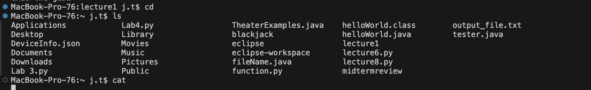
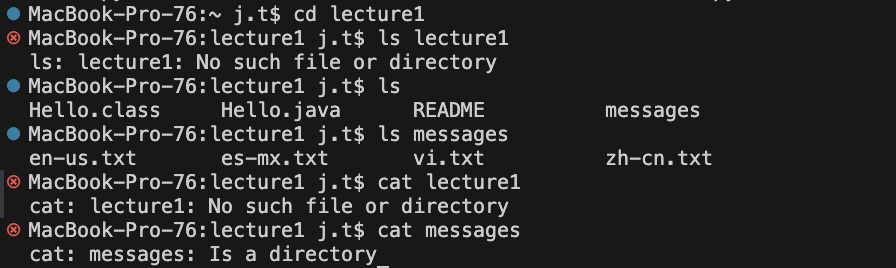
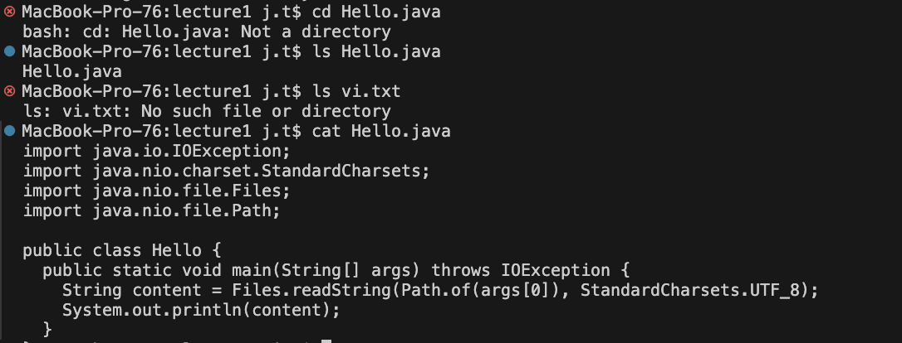

#Lab Report 1

**This an example of using cd, ls, and cat with no arguments:**

- Here cd doesn't produce anything because a directory argument isn't provided (it can't change into any directory).
- Here ls produces a list of all the files in the current directory (and if you have an argument than it lists out the files in that directory).
- Here cat produces nothing because there are no arguments.

**This an example of using cd, ls, and cat with a path to a directory as an argument:**

- Here cd changes the directory to lecture1.
- Here ls produces a list of all the files in the lecture1 directory (no arguments) or messages (when messages is the argument).
- Here cat produces an error since cat only works with files. 

**This an example of using cd, ls, and cat with a path to a file as an argument:**

- Here cd produces an error since the argument has to be a directory not a file.
- Here ls returns Hello.java when Hello.java is the argument (since Hello.java doesn't contain any other files it returns the file name).
- Here cat returns what is in Hello.java (it returns the contents of the file).

**This is the absolute path:**

